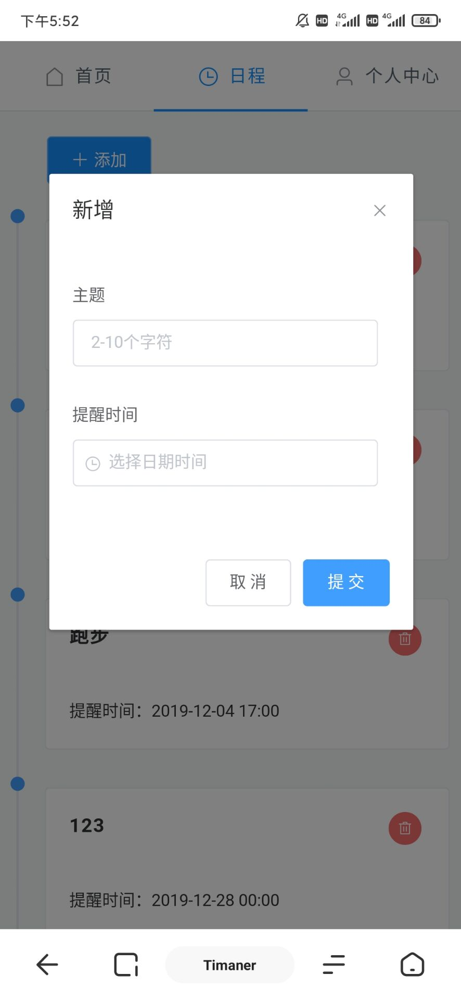
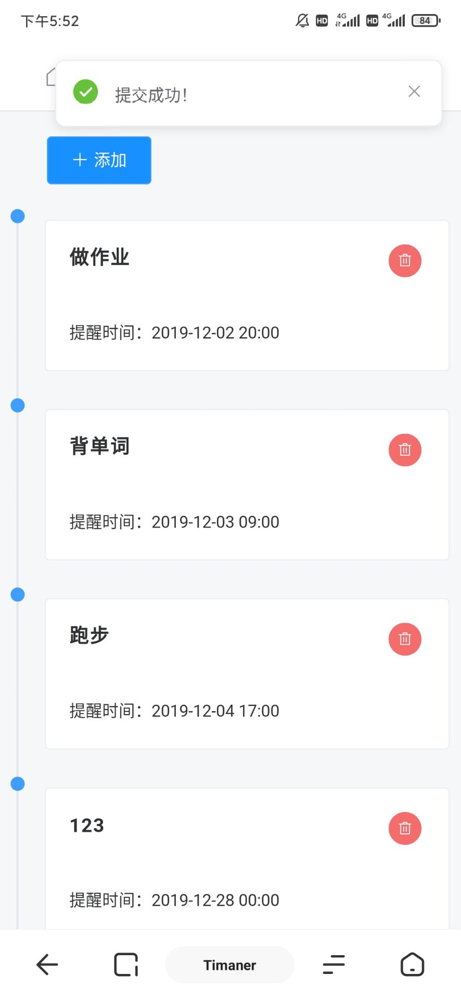

# Timaner

### 简介

> 线上地址：[Timaner](https://timaner.neoniou.com)
>
> 一款日程提醒网页，前端Vue+element开发，后端使用Springboot开发。
>
> 功能：添加提醒事项 + 到提醒时间后通过邮件提醒用户。
>
> ps : 对电脑端适配不算友好。手机访问还行。

### Project setup

```
npm install
```

### 截图







